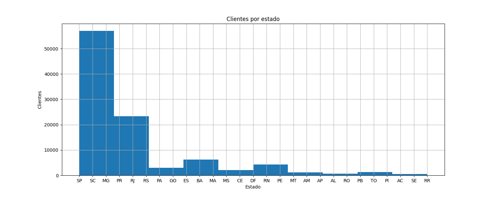

## Trabajo Práctico Integrador - Análisis de Datos

###### Autor: Gonzalo Farías

###### Fecha: 07/05/2024

---

### Resumen

Este trabajo presenta un análisis de datos realizado sobre un conjunto de datos del sector de comercio. Se aplicaron diversas técnicas de limpieza, exploración y visualización de datos para comprender mejor la información contenida en los conjuntos de datos proporcionados.

---

### Conclusiones

1. **Cantidad de Clientes Únicos:**

   - Se identificó un total de 96096 clientes únicos en el conjunto de datos de clientes.
2. **Promedio del Valor de Pago por Pedido:**

   - El promedio del valor de pago por pedido se situó en $154.1.
3. **Categoría de Productos Más Vendida:**

   - La categoría de productos más vendida fue "cama_mesa_baño", con un valor aproximado de 11500 ventas:

     
4. **Número Total de Pedidos Realizados:**

   - Se registraron un total de 98816 pedidos completados, excluyendo aquellos que fueron cancelados.
5. **Estadísticas de Precios de Productos:**

   - El análisis estadístico de los precios de los productos reveló una variación significativa entre los precios, con un rango que va desde 0.85 hasta 6735:

     
6. **Distribución de Clientes por Estado:**

   - La mayoría de los clientes se encuentran en los estados de "SP" y "SC", seguidos por "MG":

     
7. **Frecuencia de Tipos de Pago:**

   - El tipo de pago más frecuente fue "credit_card", seguido por "boleto" y "voucher":

     
8. **Relación entre Precio del Producto y Valor del Flete:**

   - No se observó una relación clara entre el precio del producto y el valor del flete, según el gráfico de dispersión generado:

     
9. **Cantidad de Compras por Mes:**

- Se observó una tendencia de crecimiento en la cantidad de ventas a lo largo del tiempo, llegando a los maximos valores a partir de octubre del año 2017:
  
  

---

### Recomendaciones

1. **Enfoque en la Categoría de Productos Más Vendida:**

   - Dado que la categoría de productos "cama_mesa_baño" es la más vendida, se recomienda enfocar las estrategias de marketing y ventas en esta categoría para maximizar los ingresos.
2. **Expansión en Regiones con Mayor Concentración de Clientes:**

   - Considerando la distribución de clientes por estado, se sugiere enfocar los esfuerzos de expansión en regiones como "SP" y "SC", donde se concentra la mayor parte de la clientela.
3. **Monitoreo Continuo de Tendencias de Ventas:**

   - Dado el análisis de la cantidad de compras por mes, se recomienda realizar un monitoreo continuo de las tendencias de ventas para identificar patrones estacionales o cambios en el comportamiento del consumidor.
4. **Mejora de la Logística de Envíos:**

   - Dado que no se observó una relación clara entre el precio del producto y el valor del flete, se sugiere mejorar la logística de envíos para optimizar los costos y tiempos de entrega.
